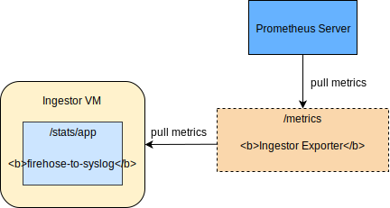

# Ingestor Exporter

A Prometheus exporter for firehose-to-syslog ingestor metrics.

## Architecture Overview


## Installation

### Binaries

Download the already existing [binaries][binaries] for your platform:

```bash
$ ./ingestor_exporter <flags>
```

### From source

Using the standard `go install` (you must have [Go][golang] already installed in your local machine):

```bash
$ go install github.com/bosh-prometheus/ingestor_exporter
$ ingestor_exporter <flags>
```

### BOSH

*It is is intended for this exporter to be able to be* deployed using the [Prometheus BOSH Release][prometheus-boshrelease]. Some work still needs to be done around this.

## Usage

### Flags

| Flags  | Required | Description |
| -------| -------- | ----------- |
| help | No | Display help options|
| version | No | Display version|

### Environment Variables

| Environment Variable  | Required | Default | Description |
| ------------- | ------------- | ----- |--------------|
| `INGESTOR_PROTOCOL`  | No  | `http` |  Ingestor protocol |
| `INGESTOR_HOSTNAME` | No  | `127.0.0.1` | Ingestor Hostname |
| `INGESTOR_PORT` | No  | `8080` | Ingestor Port |
| `INGESTOR_PATH` | No  | `/stats/app` | Ingestor Path |
| `INGESTOR_SKIP_SSL` | No  | `false` | Ingestor option to skip SSL |
| `INGESTOR_RESPONSE_TIMEOUT_SECONDS` | No  | `10` | Ingestor Response Timeout in seconds |
| `INGESTOR_EXPORTER_METRICS_ENDPOINT` | No  | `/metrics` | Ingestor Exporter Metrics Endpoint |
| `INGESTOR_EXPORTER_PORT` | No  | `9495` | Ingestor Exporter Port |
| `INGESTOR_METRICS_ENVIRONMENT` | Yes  | `""` | Name of environment ingestor runs in|

### Metrics

| Metric | Description | Labels |
| ------ | ----------- | ------- |
|`consume_total`| Messages received | `ingestor_protocol`,`ingestor_hostname`,`ingestor_port`,`ingestor_path`,`environment` |
|`consume_fail_total`| Messages failed to be consumed | `ingestor_protocol`,`ingestor_hostname`,`ingestor_port`,`ingestor_path`,`environment` |
|`consume_http_start_stop_total`| HttpStartStop messages received | `ingestor_protocol`,`ingestor_hostname`,`ingestor_port`,`ingestor_path`,`environment` |
|`consume_value_metric_total`| ValueMetric messages received | `ingestor_protocol`,`ingestor_hostname`,`ingestor_port`,`ingestor_path`,`environment` |
|`consume_counter_event_total`| CounterEvent messages received | `ingestor_protocol`,`ingestor_hostname`,`ingestor_port`,`ingestor_path`,`environment` |
|`consume_log_message_total`| Log messages received | `ingestor_protocol`,`ingestor_hostname`,`ingestor_port`,`ingestor_path`,`environment` |
|`consume_error_total`| Error messages received | `ingestor_protocol`,`ingestor_hostname`,`ingestor_port`,`ingestor_path`,`environment` |
|`consume_container_metric_total`| ContainerMetric messages received | `ingestor_protocol`,`ingestor_hostname`,`ingestor_port`,`ingestor_path`,`environment` |
|`consume_unknown_total`| Unknown type messages received | `ingestor_protocol`,`ingestor_hostname`,`ingestor_port`,`ingestor_path`,`environment` |
|`slow_consumer_alert_total`| Slow consumer alerts emitted by noaa | `ingestor_protocol`,`ingestor_hostname`,`ingestor_port`,`ingestor_path`,`environment` |
|`publish_total`|Messages| `ingestor_protocol`,`ingestor_hostname`,`ingestor_port`,`ingestor_path`,`environment` |
|`publish_fail_total`| Number of dropped messages | `ingestor_protocol`,`ingestor_hostname`,`ingestor_port`,`ingestor_path`,`environment` |
|`ignored_total`| Messages dropped due to no forwarding rule | `ingestor_protocol`,`ingestor_hostname`,`ingestor_port`,`ingestor_path`,`environment` |
|`forwarded_total`| Messages | `ingestor_protocol`,`ingestor_hostname`,`ingestor_port`,`ingestor_path`,`environment` |
|`subinupt_buffer`| Used to count number of current buffer on subInput | `ingestor_protocol`,`ingestor_hostname`,`ingestor_port`,`ingestor_path`,`environment` |
|`instance_id`| ID for nozzle instance. This is used to identify stats from different instances | `ingestor_protocol`,`ingestor_hostname`,`ingestor_port`,`ingestor_path`,`environment` |

## Contributing

We welcome any contributions. For any proposed changes, please fork the project on GitHub and open Pull Requests.

## License

BSD 3, see [LICENSE][license].

[binaries]: https://github.com/bosh-prometheus/ingestor_exporter/releases
[cloudfoundry]: https://www.cloudfoundry.org/
[golang]: https://golang.org/
[license]: LICENSE.md
[prometheus-boshrelease]: https://github.com/bosh-prometheus/prometheus-boshrelease
